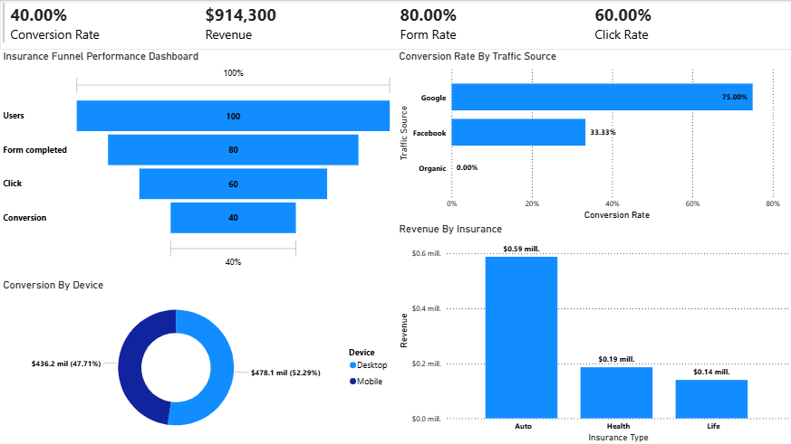

# Insurance Funnel Analysis

## Overview
This project simulates a lead generation funnel inspired by Smartly’s business model, where users are matched with insurance providers.

The goal is to analyze user behavior across the funnel and identify opportunities to improve conversion rates and revenue.

---

## Business Problem
Insurance marketplaces rely heavily on optimizing user conversion across multiple steps:
- Traffic acquisition
- Form completion
- Provider matching
- Final conversion

Understanding where users drop off is critical to improving performance.

---

## Dataset
A synthetic dataset was created to simulate real-world user behavior due to data confidentiality constraints.

It includes:
- Traffic source (Google, Facebook, Organic)
- Device type (Mobile, Desktop)
- Insurance type (Auto, Health, Life)
- Funnel progression metrics

---

## Tools Used
- Power BI (Dashboard)
- CSV (Data source)

---

## Key Metrics
- Conversion Rate
- Form Completion Rate
- Click Rate
- Revenue

---

## Key Insights
- Google traffic shows the highest conversion rate
- Facebook drives volume but lower efficiency
- Significant drop-off between form completion and click
- Auto insurance generates the highest revenue

---

## Business Recommendations
- Optimize Facebook campaigns for better conversion quality
- Improve UX between form completion and click stage
- Prioritize Auto insurance segment for revenue growth

---

## Dashboard Preview

---

## Notes
This is a simulated project created for demonstration purposes and portfolio use.
